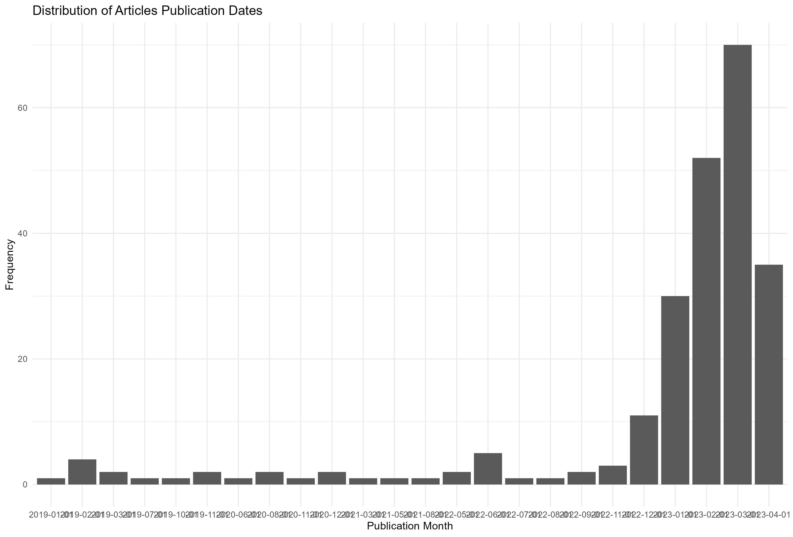
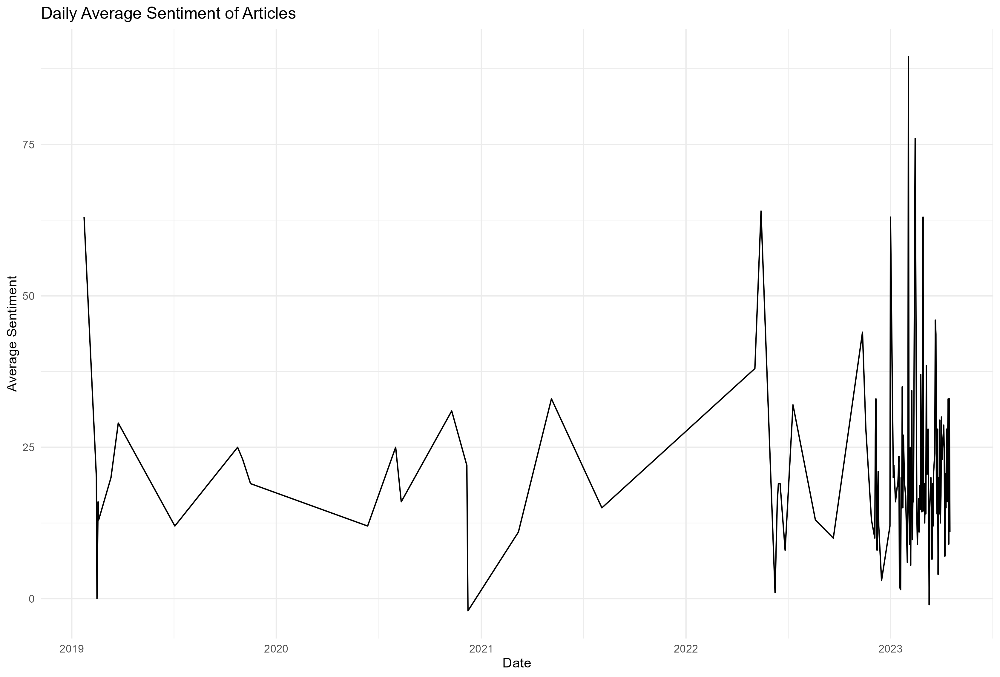
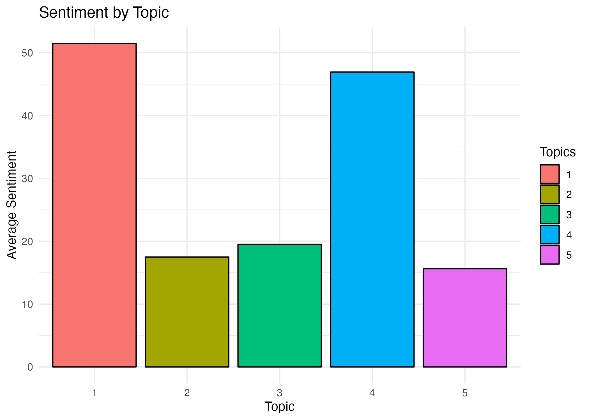
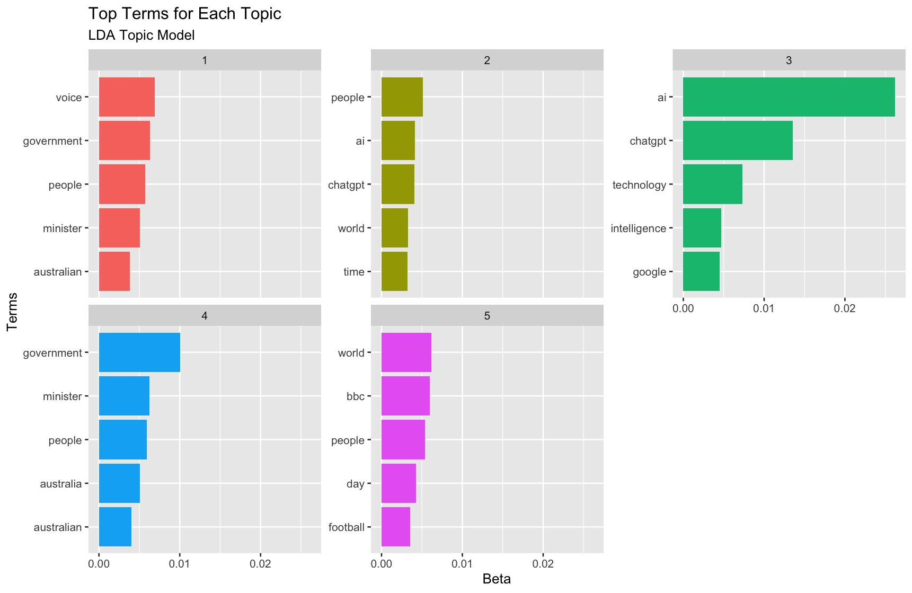

```{r setup, include=FALSE}
knitr::opts_chunk$set(echo = TRUE)
```

<br>

# 1. Introduction


The goal of this project is to analyze articles from The Guardian that mention ChatGPT, an advanced language model developed by OpenAI. I aim to understand the main topics discussed in these articles, identify any biases or unique perspectives from different authors and sections, and examine the overall sentiment towards ChatGPT. This report will present an overview of the project, the list of tasks undertaken, the challenges faced, and the results achieved.

<br>

# 2. Project Overview


The project is divided into four main phases:


1. Data collection and cleaning
2. Sentiment analysis
3. Topic modeling and author/section analysis
4. Visualization

In the first phase, I collect and clean the data using The Guardian API. In the second phase, I analyze the sentiment of the articles. In the third phase, I perform topic modeling, author, and section analysis. Finally, in the fourth phase, I create interactive visualizations to help users explore the data and gain insights.

# 3. Tasks and Technical Difficulties


### 3.1 Data Collection and Cleaning


I collected data from The Guardian API using the R package `guardianapi`. With the help of the package, I searched for articles mentioning "ChatGPT" and retrieved relevant information such as the publication date, author, and body text. During this collection, I encountered the following challenges:


- Limited number of API requests: To circumvent this issue, I carefully designed the queries and managed my API usage.
- Incomplete or messy data: Some articles had missing or improperly formatted text. Therefore I cleaned the data by removing HTML tags, special characters, and irrelevant content.

<br>

```{}

## DATA COLLECTION

# 1. install and load packages ----
# install.packages("httr")
# install.packages("jsonlite")
# install.packages("devtools") 
# install.packages("tm")
# yeyinstall.packages("stringr")
# install.packages("ggplot2")

library(httr)
library(jsonlite)
library(tidyverse)
library(devtools)
library(ggplot2)
library(lubridate)

# install.packages("devtools")
# devtools::install_github("evanodell/guardianapi")
library(guardianapi)

# 2. save personal API key ----
api_key <- rstudioapi::askForPassword('Enter your API key:')
options(gu.API.key = api_key)

# make sure the key is not pushed to github

# 3. define the search function for The Guardian API ----
articles <- gu_content(query = "openAI OR chatGPT", from_date = "2018-12-01",
                            to_date = "2023-05-05")

print(articles)
head(articles)
colnames(articles)

# 4. simplify dataframe
df_articles <- articles %>%
  filter(type == "article") %>% # remove liveblogs
  select(id, section_name, web_publication_date, web_title, headline, byline, pillar_name, body_text, wordcount)

# save dataframe
data.table::fwrite(df_articles, here::here("data", "df_articles.csv"))


# 5. Display the structure of the dataset ----
str(articles)

# a) Generate summary statistics for numeric columns
summary(articles)

```

<br>

### 3.2 FREQUENCY ANALYSIS
IIn the frequency analysis part of the project, my main goal was to understand the distribution of articles mentioning ChatGPT over time. To achieve this, I had to complete several tasks and overcome some technical challenges. The list of tasks and difficulties are as follows:

Loading the necessary libraries: To perform the analysis, I needed to load ggplot2 and lubridate libraries. These libraries enabled me to create the desired visualizations and manipulate date-related data effectively.

Calculating the frequency of articles by month: I used the floor_date function from the lubridate package to aggregate the web_publication_date data to monthly intervals. Then, I used the table function to count the number of articles in each month, which was then converted to a data frame.

Plotting the distribution of publication dates: With the aggregated data in hand, I created a bar plot using ggplot2 to visualize the frequency of articles over time. This step required setting appropriate aesthetics, labels, and themes for the plot.

Printing and saving the plot: After creating the plot, I printed the monthly_counts data frame to get an overview of the results. Finally, I saved the plot as an image file using the ggsave function.

Throughout these tasks, I faced some technical challenges, such as making sure the date manipulation was accurate and properly aggregating the data. Additionally, I had to ensure that the plot was informative and easy to understand, which required fine-tuning the visualization aesthetics and labels. By completing these tasks and overcoming the technical difficulties, I successfully achieved the goal of understanding the distribution of articles mentioning ChatGPT over time.

<br>

```{}
## FREQUENCY ANALYSIS

# Load necessary libraries
library(ggplot2)
library(lubridate)


# Calculate the frequency of articles by month
articles$month <- floor_date(articles$web_publication_date, "month")
monthly_counts <- as.data.frame(table(articles$month))


# Plot the distribution of publication dates
plot_1 <- ggplot(monthly_counts, aes(x = Var1, y = Freq)) +
  geom_col() +
  labs(x = "Publication Month", y = "Frequency", title = "Distribution of Articles Publication Dates") +
  theme_minimal()

print(monthly_counts)

# save plot
ggsave(here::here("figs", "plot 1_dist articles.png"), plot_1)
```

<br>



### 3.3 Sentiment Analysis


In this section, I detail the tasks needed to achieve the goals of sentiment analysis and identify the technical difficulties encountered. First, I preprocessed the text data using the syuzhet package and cleaned the data using a custom cleaning function. The function removes HTML tags and special characters from the text. Next, I tokenized the words using the tidytext package and removed stopwords to retain only meaningful words in the analysis. After preprocessing, I counted the frequency of words in the dataset and visualized the top 10 most frequent words.

The main technical difficulty in this stage was the need to create a custom cleaning function to remove HTML tags and special characters, as these elements may introduce noise in the sentiment analysis. Another challenge was the choice of an appropriate stopwords list, as the removal of too few or too many stopwords can impact the quality of the analysis.

For calculating daily average sentiment, I used the get_sentiment() function from the syuzhet package with the "nrc" method. I grouped the sentiment scores by date and calculated the mean sentiment for each day. The resulting daily average sentiment scores were plotted using ggplot2.

The primary technical challenge in this step was the aggregation of sentiment scores by date. The lubridate package was used to floor the publication date to the nearest day, ensuring that the daily average sentiment was calculated correctly. Additionally, the choice of sentiment analysis method ("nrc" in this case) could impact the results, and a different method might produce different sentiment scores.

Finally, I saved the generated plots as PNG files for future reference and inclusion in the report.

<br>

```{}
## SENTIMENT ANALYSIS

# 1. Preprocessing ----

# install.packages("syuzhet")
library(syuzhet)

# Load necessary libraries
library(tidytext)
library(dplyr)
library(stringr)
library(tm)
library(lubridate)

## a. Clean the text data.

# Define the cleaning function
clean_text <- function(text) {
  cleaned_text <- str_replace_all(text, "<[^>]*>", "") # Remove HTML tags
  cleaned_text <- gsub("[^[:alnum:]///' ]", "", cleaned_text) # Remove special characters
  return(cleaned_text)
}

# Print the column names of the dataset
colnames(articles)

# Apply the cleaning function to the bodytext column
articles$body_text_cleaned <- clean_text(articles$body_text)

## b. Tokenize the words.

# Tokenize the words
chatgpt_tidy <- articles %>%
  unnest_tokens(word, body_text_cleaned)

## c. Remove stopwords.

# Load the stopwords
data("stop_words")

# Remove stopwords
chatgpt_tidy <- chatgpt_tidy %>%
  anti_join(stop_words)

## d. Count the frequency of words.

word_counts <- chatgpt_tidy %>%
  count(word, sort = TRUE)

## e. Visualize the most frequent words.

# Plot the top 10 most frequent words
plot_2 <- word_counts %>%
  top_n(10) %>%
  ggplot(aes(x = reorder(word, n), y = n)) +
  geom_col() +
  coord_flip() +
  labs(x = "Words", y = "Frequency", title = "Top 10 Most Frequent Words") +
  theme_minimal()

# save plot
ggsave(here::here("figs", "plot 2_top 10 words.png"), plot_2)

# 2. Calculate daily average sentiment ----
# Assuming chatgpt_sentiment has a date column named 'date'

# Calculate sentiment scores
chatgpt_sentiment <- articles %>%
  select(web_publication_date, body_text_cleaned) %>%
  mutate(sentiment = get_sentiment(body_text_cleaned, method = "nrc")) %>%
  mutate(date = floor_date(web_publication_date, "day")) %>%
  group_by(date) %>%
  summarize(avg_sentiment = mean(sentiment))

plot_3 <- ggplot(chatgpt_sentiment, aes(x = date, y = avg_sentiment)) +
  geom_line() +
  labs(x = "Date", y = "Average Sentiment", title = "Daily Average Sentiment of Articles") +
  theme_minimal()

# save plot
ggsave(here::here("figs", "plot 3_avg sentiment.png"), plot_3)

```

<br>



### 3.4 Topic Modeling and Author/Section Analysis


For topic modeling, I used the Latent Dirichlet Allocation (LDA) method from the `topicmodels` package. I prepared the data by creating a document-term matrix (DTM) and applied the LDA model to uncover the main topics discussed in the articles. I then calculated the sentiment scores for each topic. 


For author and section analysis, I compared sentiment scores across different authors and sections. The main technical challenges in this section include preparing the data for topic modeling, fitting the LDA model, extracting and displaying the top terms for each topic, and visualizing the results. These challenges can be addressed using the appropriate R functions and libraries, as seen in the code.

<br>

```{}
## TOPIC MODELLING

# Load additional required libraries
install.packages('topicmodels')
install.packages('plotly')
library(topicmodels)
library(plotly)

# 1. Topic modeling
## a. Apply LDA 
### Prepare the data for topic modeling by removing stopwords and words containing only digits:
chatgpt_tidy <- chatgpt_tidy %>%
  anti_join(stop_words) %>%
  filter(!str_detect(word, "^\\d+$")) # Remove words containing only digits

# 2. Create a Document-Term Matrix
### Create a Document-Term Matrix (DTM), which is a matrix that shows 
### the frequency of terms in each document:
dtm <- chatgpt_tidy %>%
  count(id, word) %>%
  cast_dtm(document = id, term = word, value = n)

# 3. Fit the LDA model
### Fit an LDA (Latent Dirichlet Allocation) model to the DTM. This model 
### helps to identify the underlying topics in the text data:
lda_model <- LDA(dtm, k = 5, control = list(seed = 1234))

# 4. Get the top terms for each topic
### Extract the top terms for each topic from the LDA model:
topic_terms <- tidy(lda_model, matrix = "beta")

# 5. Find the main topic for each document
### Find the main topic for each document using the gamma matrix 
### of the LDA model:
document_topics <- tidy(lda_model, matrix = "gamma") %>%
  group_by(document) %>%
  top_n(1, wt = gamma) %>%
  ungroup()

# 6. Calculate sentiment scores for each document
chatgpt_sentiment <- chatgpt %>%
  select(id, web_publication_date, bodytext_cleaned) %>%
  mutate(sentiment = get_sentiment(bodytext_cleaned, method = "nrc")) %>%
  mutate(date = floor_date(web_publication_date, "day")) %>%
  group_by(id, date) %>%
  summarize(avg_sentiment = mean(sentiment), .groups = "drop")


# 7. I  Merge the main topics with sentiment scores
chatgpt_sentiment_topics <- chatgpt_sentiment %>%
  inner_join(document_topics, by = c("id" = "document"))

# 8. Calculate average sentiment by topic
sentiment_by_topic <- chatgpt_sentiment_topics %>%
  group_by(topic) %>%
  summarize(avg_sentiment = mean(avg_sentiment))

sentiment_by_topic

# 9. Create a bar plot of average sentiment by topic
sentiment_plot <- ggplot(sentiment_by_topic, aes(x = factor(topic), y = avg_sentiment, fill = factor(topic))) +
  geom_bar(stat = "identity", color = "black") +
  labs(x = "Topic", y = "Average Sentiment", title = "Sentiment by Topic") +
  scale_fill_discrete(name = "Topics") +
  theme_minimal()

# Display the plot
print(sentiment_plot)

# Optionally, save the plot to a file
ggsave("sentiment_by_topic_plot.png", sentiment_plot, width = 7, height = 5, dpi = 300)


# Arrange the top terms for each topic:
top_topic_terms <- topic_terms %>%
  group_by(topic) %>%
  top_n(5, beta) %>%
  ungroup() %>%
  arrange(topic, -beta)

#Display the top terms for each topic in a readable format:
top_topic_terms <- topic_terms %>%
  group_by(topic) %>%
  top_n(5, beta) %>%
  ungroup() %>%
  arrange(topic, -beta)

topic_term_table <- top_topic_terms %>%
  group_by(topic) %>%
  mutate(rank = row_number()) %>%
  ungroup() %>%
  pivot_wider(names_from = rank, values_from = term) %>%
  select(topic, `1`, `2`, `3`, `4`, `5`)

print(topic_term_table)

ggsave(here::here("figs", "plot 4_topic_term_table.png"), topic_term_table)
```

<br>






### 3.5 Visualization


I created interactive visualizations using the `plotly` package. Although creating interactive plots required a different approach than static plots (e.g., with `ggplot2`), I successfully built various interactive visualizations to aid users in exploring the data and understanding the analysis.

<br>

```{}
## INTERACTIVE GRAPHS

# 1. Author and section analysis
## Compare sentiment scores across different authors and sections
sentiment_by_author_section <- chatgpt %>%
  select(author = byline, section_name, web_publication_date, bodytext_cleaned) %>%
  mutate(sentiment = get_sentiment(bodytext_cleaned, method = "nrc")) %>%
  group_by(author, section_name) %>%
  summarize(avg_sentiment = mean(sentiment))

# 2. Visualization
## Create interactive visualizations using plotly
# 2.1 Interactive line plot of daily average sentiment

plot_daily_sentiment <- ggplot(chatgpt_sentiment, aes(x = date, y = avg_sentiment)) +
  geom_line() +
  labs(x = "Date", y = "Average Sentiment", title = "Daily Average Sentiment of Articles") +
  theme_minimal()

# Convert the ggplot object to a plotly object
plotly_daily_sentiment <- ggplotly(plot_daily_sentiment)

# Display the interactive plot
plotly_daily_sentiment

# 2.2 Interactive bar plot of average sentiment by topic:
plot_sentiment_by_topic <- ggplot(sentiment_by_topic, aes(x = reorder(factor(topic), avg_sentiment), y = avg_sentiment)) +
  geom_col() +
  labs(x = "Topic", y = "Average Sentiment", title = "Average Sentiment by Topic") +
  theme_minimal()

plotly_sentiment_by_topic <- ggplotly(plot_sentiment_by_topic)
plotly_sentiment_by_topic

# 2.3 Interactive bar plot of average sentiment by author:
top_authors <- sentiment_by_author_section %>%
  top_n(10, wt = avg_sentiment)

plot_sentiment_by_author <- ggplot(top_authors, aes(x = reorder(author, avg_sentiment), y = avg_sentiment)) +
  geom_col() +
  labs(x = "Author", y = "Average Sentiment", title = "Average Sentiment by Author") +
  theme_minimal() +
  theme(axis.text.x = element_text(angle = 45, hjust = 1))

plotly_sentiment_by_author <- ggplotly(plot_sentiment_by_author)
plotly_sentiment_by_author


# 2.4 Sentiment by section
plot_sentiment_by_section <- ggplot(sentiment_by_author_section, aes(x = reorder(section_name, avg_sentiment), y = avg_sentiment)) +
  geom_col() +
  labs(x = "Section", y = "Average Sentiment", title = "Average Sentiment by Section") +
  theme_minimal() +
  theme(axis.text.x = element_text(angle = 45, hjust = 1))

plotly_sentiment_by_section <- ggplotly(plot_sentiment_by_section)
plotly_sentiment_by_section

# 2.5 Sentiment by date
plot_sentiment_by_date <- ggplot(chatgpt_sentiment, aes(x = date, y = avg_sentiment)) +
  geom_point(alpha = 0.5) +
  labs(x = "Publication Date", y = "Sentiment Score", title = "Sentiment Scores by Publication Date") +
  theme_minimal()

plotly_sentiment_by_date <- ggplotly(plot_sentiment_by_date)
plotly_sentiment_by_date
```

<br>


# 4. Results and Challenges


Overall, the project was successful in achieving most of its goals. I encountered some challenges during the data collection and cleaning phases, as well as during sentiment analysis preprocessing. However, I managed to overcome these difficulties using appropriate R packages and custom functions.

**Achievements:**

- Cleaned and preprocessed data for analysis
- Performed sentiment analysis on the articles
- Identified the main topics discussed in the articles using topic modeling
- Analyzed sentiment scores for each topic
- Compared sentiment scores across different authors and sections
- Created interactive visualizations to present the results

## 5. Limitations


Despite the success in achieving most of the project goals, some limitations remained:

- The analysis relies on The Guardian API, which may not provide a comprehensive view of all articles mentioning ChatGPT. It is possible that some relevant articles were missed due to API limitations or search constraints.
- Sentiment analysis and topic modeling methods may not be perfect in capturing the nuances of language and the true sentiment of the articles. The accuracy of these methods depends on the quality of the text preprocessing and the choice of algorithms.
- The scope of this project is limited to articles from The Guardian. This may not provide a complete picture of the coverage of ChatGPT across different media outlets and perspectives.

# 6. Conclusion
In conclusion, this project successfully analyzed articles from The Guardian that mention ChatGPT. I collected and cleaned the data, performed sentiment analysis, uncovered the main topics discussed, and compared sentiment scores across different authors and sections. Despite some limitations, the project achieved most of its goals and provided valuable insights into the coverage of ChatGPT in The Guardian.

Further research may expand this analysis to include additional media outlets, languages, and timeframes, providing a broader understanding of ChatGPT's coverage in the media landscape. Additionally, future work may explore the use of more advanced natural language processing techniques, such as transformer-based models, to improve sentiment analysis and topic modeling accuracy.


